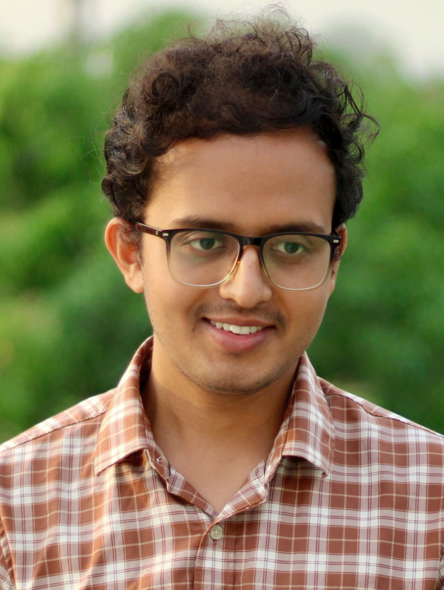

Welcome! I am a Research Scholar at IIT Kanpur specializing in Space Borne Computation: LEO satellite constellations & Synthetic Aperture Radar (SAR) based Eatrth Imaging. 

My technical focus lies in deep learning and space borne computation, but this space is designed to capture all aspects of my work—from multi-GPU model training in the lab to the rhythms of Hindustani Classical music and the quiet moments captured through my camera lens.
