

  
Photography is my deliberate offline escape. A documentation of the world outside the lab, from the quiet moments in nature to the vibrant energy of the streets.

  
  <a href="https://instagram.com/atasmin_tad_buddhih" target="_blank" class="insta-button">
    <svg xmlns="http://www.w3.org/2000/svg" width="20" height="20" viewBox="0 0 24 24" fill="currentColor">
      <path d="M12 2.163c3.204 0 3.584.012 4.85.07 3.252.148 4.771 1.691 4.919 4.919.058 1.265.069 1.645.069 4.849 0 3.205-.012 3.584-.069 4.849-.149 3.225-1.664 4.771-4.919 4.919-1.266.058-1.644.07-4.85.07-3.204 0-3.584-.012-4.849-.07-3.26-.149-4.771-1.699-4.919-4.92-.058-1.265-.07-1.644-.07-4.849 0-3.204.013-3.583.07-4.849.149-3.227 1.664-4.771 4.919-4.919 1.266-.057 1.645-.069 4.849-.069zm0-2.163c-3.259 0-3.667.014-4.947.072-4.358.2-6.78 2.618-6.98 6.98-.059 1.281-.073 1.689-.073 4.948 0 3.259.014 3.668.072 4.948.2 4.358 2.618 6.78 6.98 6.98 1.281.058 1.689.072 4.948.072 3.259 0 3.668-.014 4.948-.072 4.354-.2 6.782-2.618 6.979-6.98.059-1.28.073-1.689.073-4.948 0-3.259-.014-3.667-.072-4.947-.196-4.354-2.617-6.78-6.979-6.98-1.281-.059-1.69-.073-4.949-.073zm0 5.838c-3.403 0-6.162 2.759-6.162 6.162s2.759 6.163 6.162 6.163 6.162-2.759 6.162-6.163c0-3.403-2.759-6.162-6.162-6.162zm0 10.162c-2.209 0-4-1.79-4-4 0-2.209 1.791-4 4-4s4 1.791 4 4c0 2.21-1.791 4-4 4zm6.406-11.845c-.796 0-1.441.645-1.441 1.44s.645 1.44 1.441 1.44c.795 0 1.439-.645 1.439-1.44s-.644-1.44-1.439-1.44z"/>
    </svg>
    Find more on Instagram
  </a>

  <h2 class="gallery-title">Avian Photography</h2>
  
  

    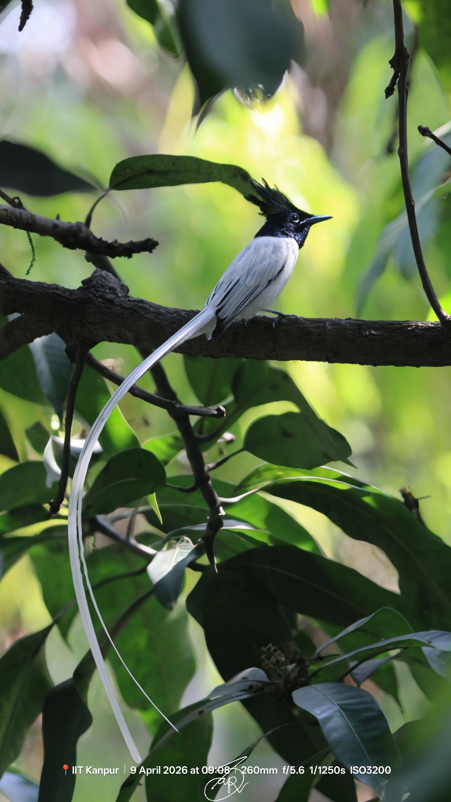
    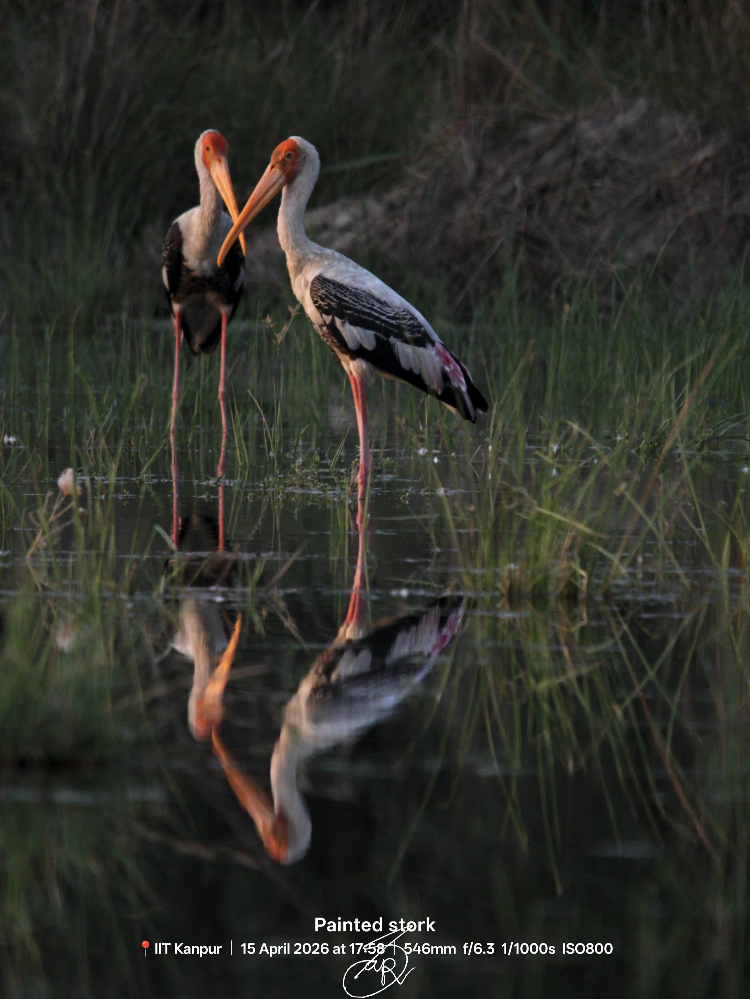
    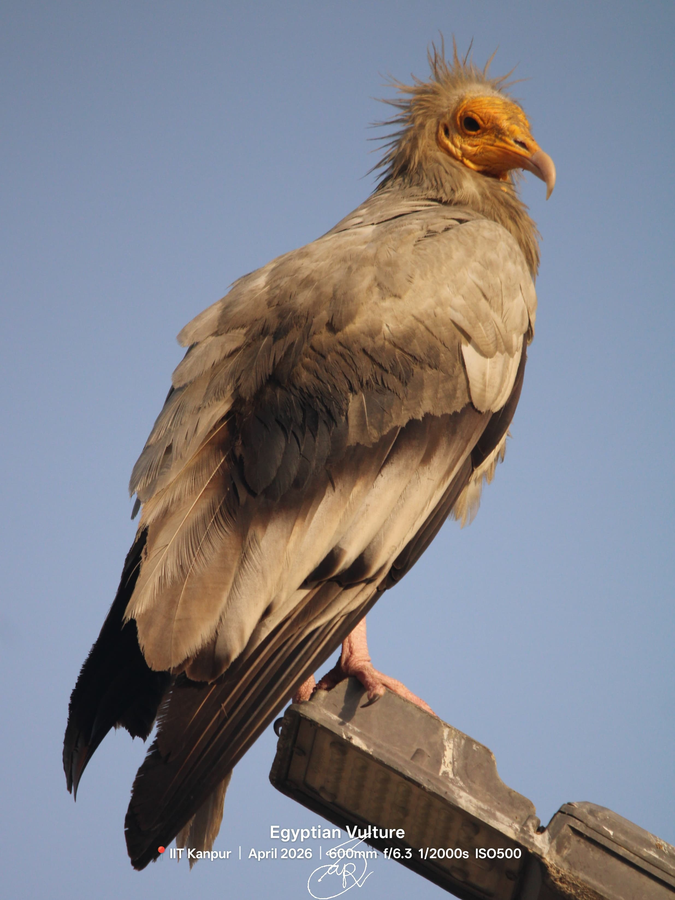
    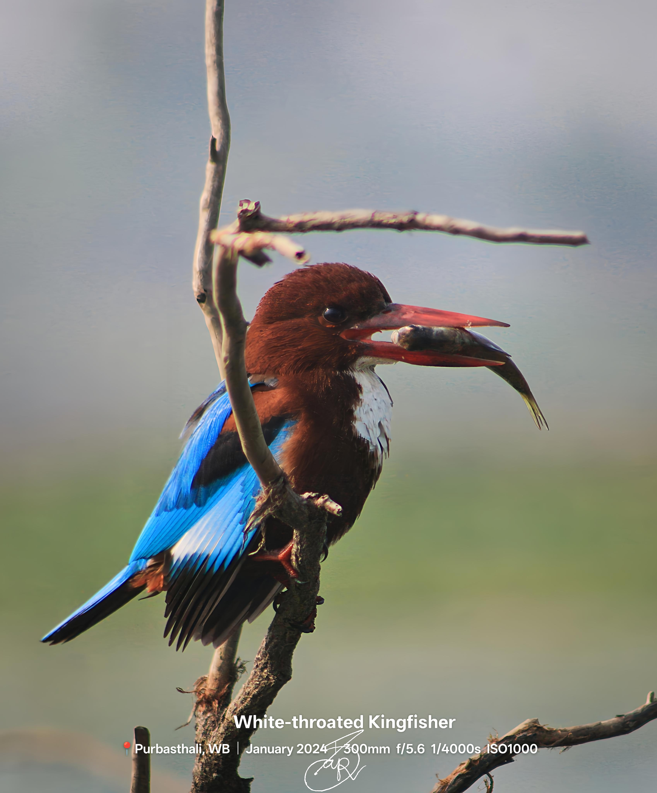
    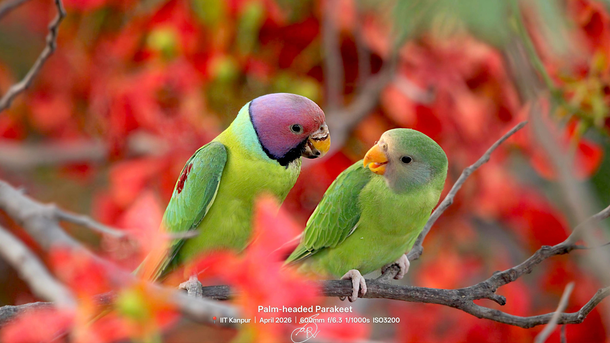
    

  

    
📋 View Complete Species Checklist

    <ul class="species-list">
      <li>Spotted Owlet <em>(Athene brama)</em></li>
      <li>Indian Roller <em>(Coracias benghalensis)</em></li>
      <li>White-throated Kingfisher <em>(Halcyon smyrnensis)</em></li>
      <li>Indian Peafowl <em>(Pavo cristatus)</em></li>
      <li>Asian Green Bee-eater <em>(Merops orientalis)</em></li>
      <li>Coppersmith Barbet <em>(Psilopogon haemacephalus)</em></li>
      <li>Rufous Treepie <em>(Dendrocitta vagabunda)</em></li>
      </ul>
  

  <h2 class="gallery-title">IIT Kanpur Campus</h2>
  

    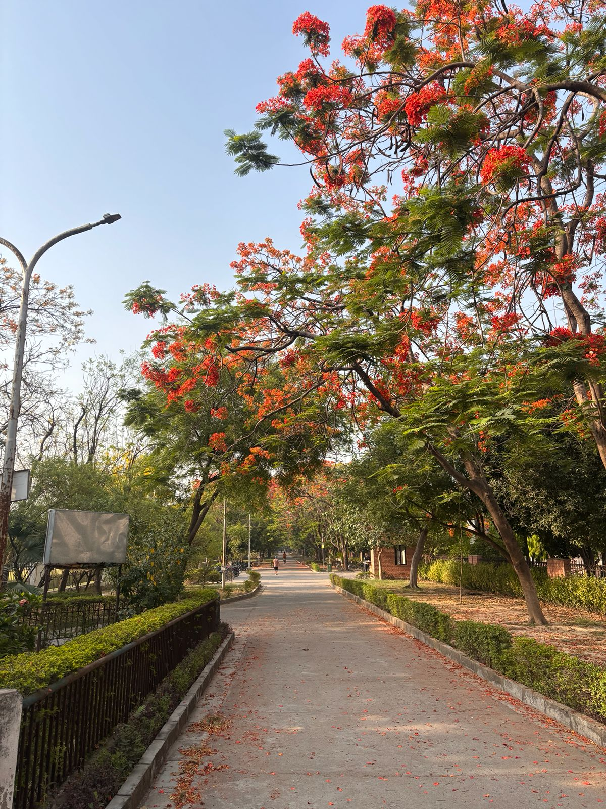
    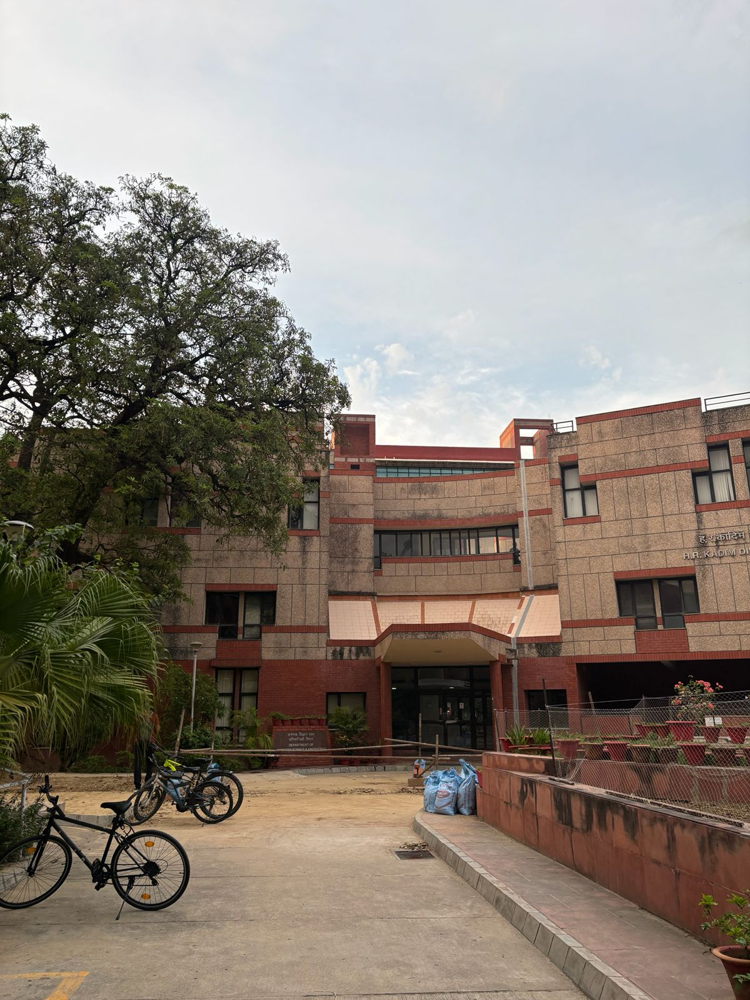
    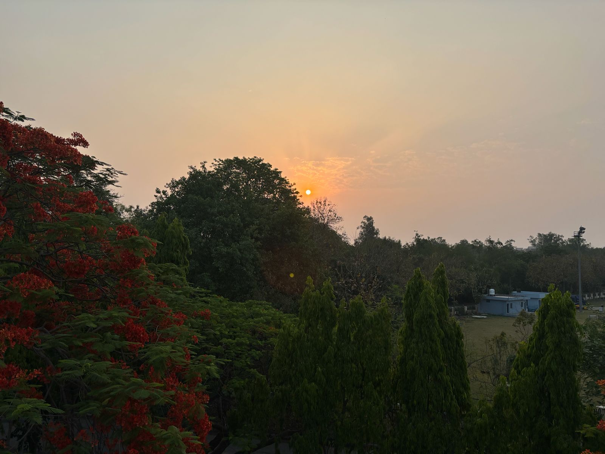
    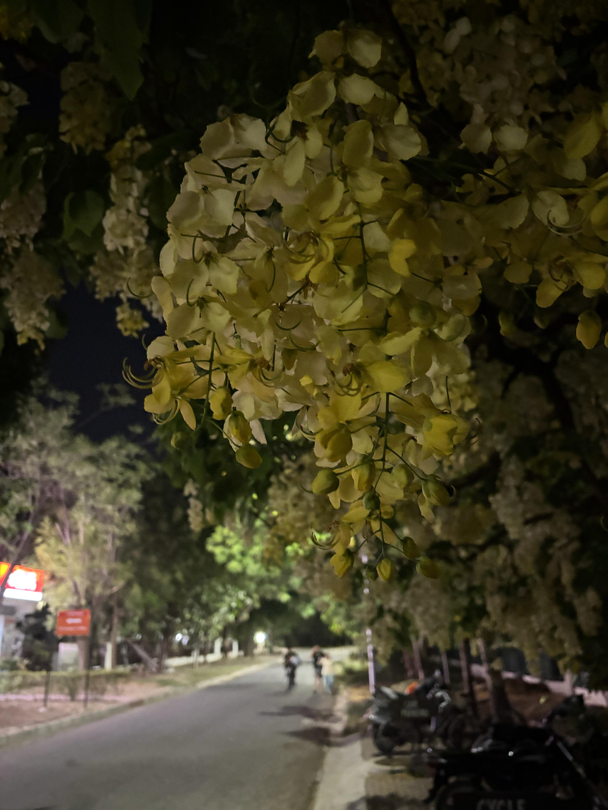
  

  <h2 class="gallery-title">Ravindra Sarovar Kolkata</h2>
  

    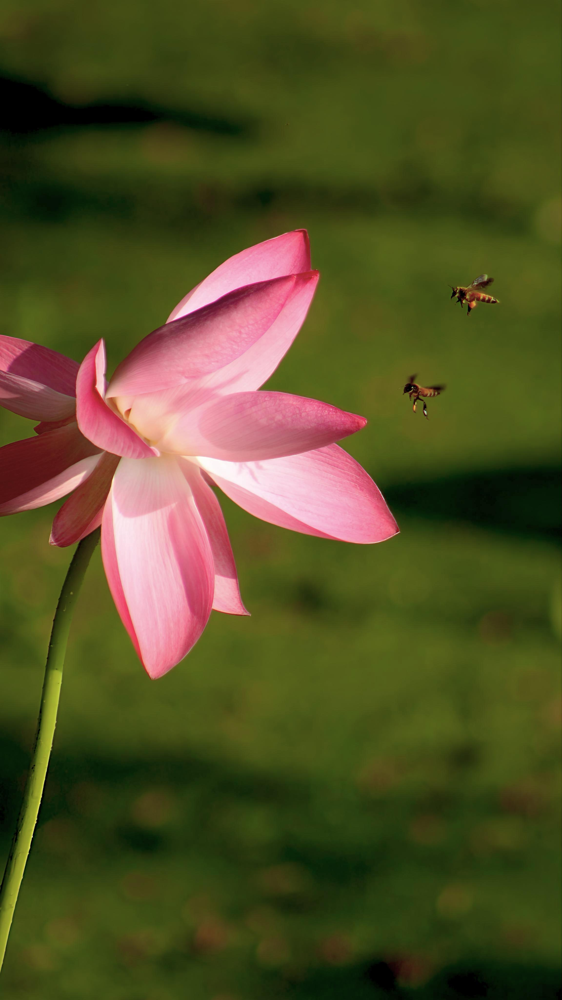
    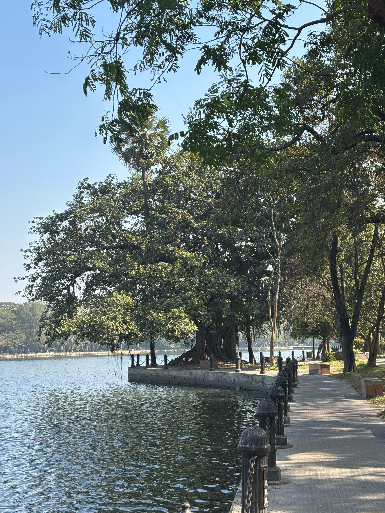
    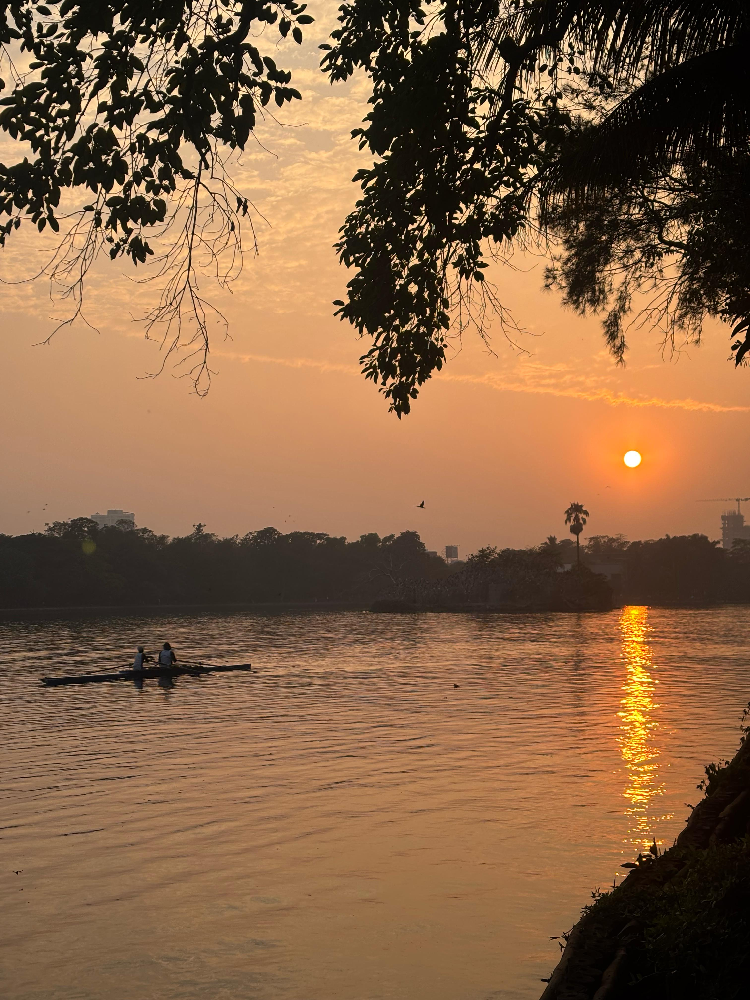
    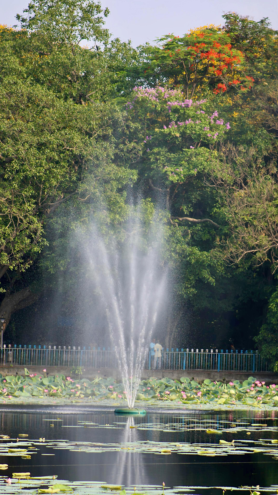
  

